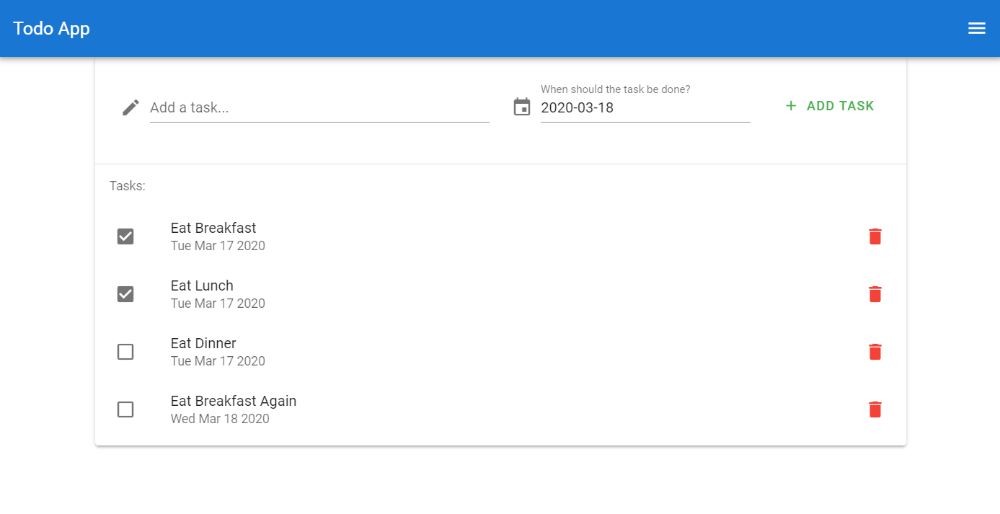

# Lab 6B - Vue.js Front-End App

## Overview

You've now created an API and hosted it so that it's publicly available. But an API is not great when you have users who want to interact with your application. So we'll make a client that will communicate with your API.

We'll be using Vue.js, a front-end javascript framework built on Node.js, which makes development very nice and easy, but also provides some incredibly useful tools that make building a website incredibly nice. It is strongly recommended to review each of the resources before starting this lab.



### Functionality

- Front-end only framework that communicates with a backend

### Concepts

- Vue.js
  - Build Tools (webpack)
  - Single-Page Apps
  - Components
    - Props
    - Data
    - Methods
    - Computed
- CI/CD Pipelines
- XHR Requests (AJAX)
  - `fetch()` Browser API
- Progressive Web Apps (PWA)

### Resources

- [What is Vue.js?](https://vuejs.org/v2/guide/#What-is-Vue-js)
- [Vue CLI](https://vuejs.org/v2/guide/installation.html#CLI)
- [Vue.js devtools](https://chrome.google.com/webstore/detail/vuejs-devtools/nhdogjmejiglipccpnnnanhbledajbpd?hl=en)

### Assignments

Lab Writeup Instructions are in the "Content" tab in [Learning Suite](https://learningsuite.byu.edu).

## Instructions

### Step 1: Setup
1. Clone the lab-6b git-hub repo from Learning Suite onto your computer.

1. Install the [Vue CLI](https://vuejs.org/v2/guide/installation.html#CLI), and run the following command in a terminal:

   ```sh
   vue ui
   ```

2. Open a browser to [http://localhost:8000/project/select](http://localhost:8000/project/select) and click `Create`

   - Select the repository cloned from Learning Suite as the destination to create your new vue project

3. On the next screen, on the `Details` tab:

   - Select `npm` as the "Package manager"
   - Click `Next`

4. You should now be in the `Presets` tab

   - Select `Manual` and click `Next`

5. Select the following features and then click `Next`:

   - Babel
   - Progressive Web App (PWA) Support
   - Router

6. In the `Configuration` tab, enable history mode for router

7. Click `Create Project`

8. You should now be looking at [http://localhost:8000/dashboard](http://localhost:8000/dashboard)

   - Click the `Configuration` tab on the left
   - Click the PWA tab
   - Give your app a name
   - Change the colors if you want to

### Step 2: Create your Project

1. On the top-left of the screen, you can select the dropdown where your project name is, and click `Open in editor`, which should open VSCode to your project

2. Install the [Vetur](https://marketplace.visualstudio.com/items?itemName=octref.vetur) extension for VSCode

3. Explore your app

   - You'll notice that almost all of the `.vue` files have 3 sections:
     - `<template>`
       - This is where your HTML for the component goes
       - Just regular HTML with some interesting attributes that tell Vue what to do
     - `<script>`
       - The code behind your component
       - This is where you define how your component uses the data available to it
     - `<style>`
       - This is just plain CSS, and if you add the `scoped` attribute to the `<style>` tag, the CSS will only apply to the HTML in the `<template>` section, and nowhere else on the site
   - You can leave the `HelloWorld` component as-is, and use it as a reference for the future
   
4. Add a Vue Plugin called `Vuetify`

   - Go to the [dashboard](http://localhost:8000/dashboard) and click Plugins
   - Click <kbd>+ Add plugin</kbd> on the top right
   - Search "vuetify"
   - Select `vue-cli-plugin-vuetify`
   - Click <kbd>Install vue-cli-plugin-vuetify</kbd> on the bottom-right
   - Once it installs, it will ask you to configure the plugin
     - Select the `Configure (advanced)` option from the dropdown
     - Make sure the setting for `Use a pre-made template` is ON
     - `Use custom theme` should be OFF
     - `Use custom properties (CSS variables)` should be OFF
     - `Material Design Icons` should be selected
     - `Use fonts as a dependency` should be ON
     - `Use a-la-carte components` should be ON
     - locale should be English
   - Click <kbd>Finish installation</kbd>

5. Go to the integrated terminal in VSCode and run the command `npm run serve` to run your app

   >When you make changes in your code, you'll notice that it automatically re-loads in the browser. That's one of the many benefits of working with front-end frameworks. They take care of a lot for you so that you can focus on development.
   

### Step 3: Connect your API
If you set up your API corectly in the last lab all you should need to do to hook up the vue application is change the `.env` variable `CLIENT_ORIGIN` to whatever the current URL of your front-end vue project is when it's running. Make sure not to have a dangling `/` on the end of your `CLIENT_ORIGIN` URL.

   >Tip: In order to run your server without having a console open constantly, you can use the __global__ npm package [pm2](https://pm2.keymetrics.io/). Use the command `npm i -g pm2`. The `-g` flag tells npm to install the package globally, as a command line tool (not to your `package.json`). Run your server using `pm2 start server.js`. If you need to stop it, run `pm2 stop server.js` or `pm2 stop all`. 


### Step 4: Modify Your Vue Project

So now you have a working Vue app! The next step is to modify the project to make it do what you want it to do.

>Before you continue: Read the provided [Vue Basics Document](Vue-Basics.md) before continuing, as you'll want to understand what's happening. Also, make sure that before you ask the TAs any questions that you read ALL of the comments in the provided code. They may answer your question.

1. If your app is running, stop it, and then install [vue-async-computed](https://www.npmjs.com/package/vue-async-computed):
   ```
   npm i vue-async-computed
   ```

2. `.env`
   - If it's not already there, create a new file on the same level as `package.json` called `.env` (you may copy the file `.env.example`)
   - Add a variable called `VUE_APP_API_ORIGIN` that's set to the URL of your running API
     - This is so that it's easy to switch between your development API and your

3. `public/_redirects`

   - There should be no file extension, JUST the name (i.e. NOT `_redirects.txt`)
   - Add the following line and save the file:
     ```
     /*    /index.html   200
     ```

4. `src/main.js`

   - Import `vue-async-computed`
     ```js
     import AsyncComputed from 'vue-async-computed'
     ```
   - Add the following line above the `new Vue({` line:
     ```js
     Vue.use(AsyncComputed)
     ```
>Tip: The next part of the lab is complicated and involves editing a lot of files. The best way to go about completing the application would be to download/copy all the files first and read all the `TODO` comments in each file to understand the relationship between them. After you understand the basics of the code that is already written for you and which files depend on others, start adding your own code in a way that makes sense to you. You do not have complete the files in the order they are listed below.

5. `src/App.vue`
   - We provide this file for you, [download or copy it from here](App.vue) and put it in the `src` folder. This file will define the parts of your application that need to be on every page. For instance, in this file you will create a nav bar that will appear on top of all the other pages in your application. 
   - Use the [Vue documentation](https://vuejs.org/v2/guide/components-props.html) to figure out how to use props
     >Note: Passing props to a "view" is different than to a "component". We first have to pass the props into the `<router-view>` component, and then in the `router/index.js` file we have to tell Vue Router which route will use these props by setting `props: true` on the route.
   - Finish the component by taking care of all of the `TODO` comments
   
6. `src/util/index.js`

   - We provide this file for you, [download or copy it from here](index.js) and put it in the `src/util/index.js`

7. `src/router/index.js`

   - Import the `authenticated` method from `'@/util'`
   - Add this `checkAuth` method above where `const routes` is defined:
     ```js
     const checkAuth = async (to, from, next) => {
       try {
         if (await authenticated()) next()
         else next({
           path: '/login',
           replace: true
         })
       } catch (error) {
         console.error(error.message)
         next({
           path: '/login',
           replace: true
         })
       }
     }
     ```
   - Modify the route object for the `Home` route:
     ```js
     {
       path: '/',
       name: 'Home',
       component: Home,
       beforeEnter: checkAuth,
       props: true
     }
     ```
   - Add a `Login` route:
     ```js
     {
       path: '/login',
       name: 'Login',
       component: Login,
     }
     ```
   - Remember to import the appropriate components for each route from the `'@/views'` folder


#### Components

1. `src/components/AppBar.vue`

   - We provide this file for you, [download or copy it from here](AppBar.vue) and put it in the `src/components` folder
   - Finish the component by taking care of all of the `TODO` comments

2. `src/components/TaskList.vue`

   - We provide this file for you, [download or copy it from here](TaskList.vue) and put it in the `src/components` folder
   - Finish the component by taking care of all of the `TODO` comments

3. `src/components/NewTaskForm.vue`

   - We provide this file for you, [download or copy it from here](NewTaskForm.vue) and put it in the `src/components` folder
   - Finish the component by taking care of all of the `TODO` comments

#### Views

1. `src/views/Login.vue`

   - We provide this file for you, [download or copy it from here](Login.vue) and put it in the `src/views` folder

2. `src/views/Home.vue`

   - We provide this file for you, [download or copy it from here](Home.vue) and put it in the `src/views` folder
   - Finish the component by taking care of all of the `TODO` comments
     
# Vue.js Front-End App Passoff

- [ ] Code is backed up on GitHub
- [ ] GET request to `/api/v1/user` can also be hit manually after logging in
- [ ] Logging out makes it so the home page redirects to `/login` again
- [ ] There are no visible connection strings or passwords in the GitHub Repository (other than the one that comes with the app)
- [ ] A user who registered on your Azure site can login on your Vue site
- [ ] Users cannot see the list of tasks unless they're logged in
- [ ] Trying to navigate to the home page automatically redirects to the login page
- [ ] Sessions are stored in MongoDB Atlas

# Extra Credit

> Note: TAs cannot help you with extra credit!

- [ ] 15 Points - Show user's Google photo and name instead of their email on the side drawer
  - HINT: You'll have to change the backend to include another scope when authenticating with Google, then pass that data to the front-end somehow

# Writeup Questions

- Why use Vue over other web frameworks that you have experience with?
- Explain a situation where it would make sense to use a computed property instead of a property in the `data` object
- Why are Vue projects called "single-page applications"? What does that mean?

# Also...

Your website is a [PWA (Progressive Web Application)](https://blog.bitsrc.io/what-is-a-pwa-and-why-should-you-care-388afb6c0bad), so you should try to install it as an app on your phone or your desktop!


